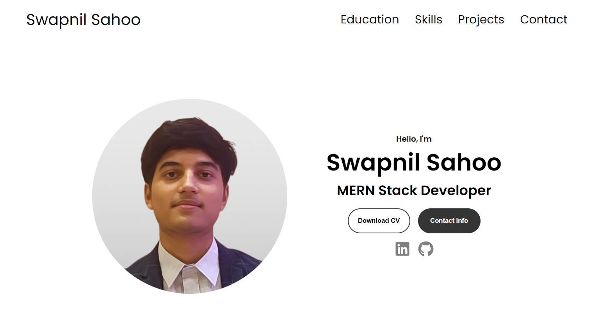
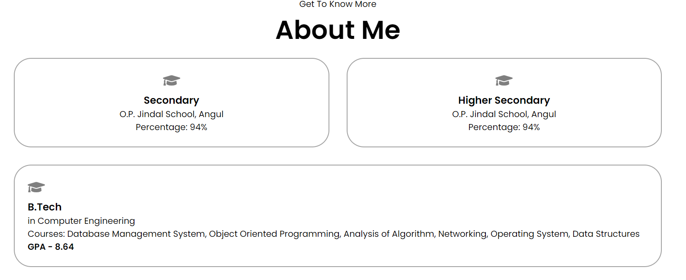
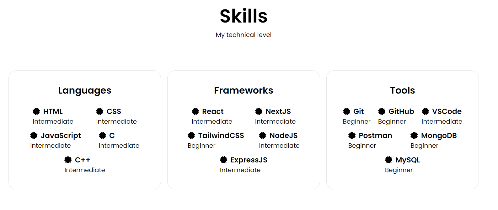
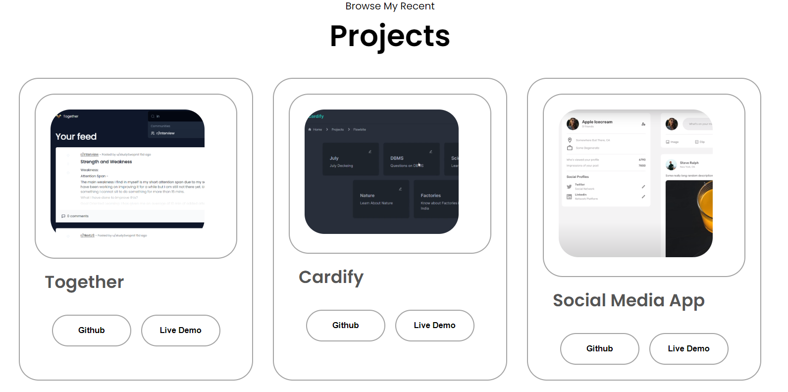

Welcome to my Resume Website! This is a simple website built with React to showcase my resume and skills.

## Table of Contents

- [Description](#description)
- [Installation](#installation)
- [Usage](#usage)
- [Tasks to be Completed](#tasks-to-be-completed)
- [Screenshots](#screenshots)

## Description

This project is a personal resume website created using React. It serves as a platform to display my resume, skills, and provide information about me. The website aims to present my qualifications and experiences in an organized and visually appealing manner.

## Installation

1. Clone the repository to your local machine:

   ```
   git clone https://github.com/your-username/resume-website.git
   ```

2. Navigate to the project directory:

   ```
   cd resume-website
   ```

3. Install the project dependencies using npm

   ```
   npm install
   ```

## Usage

To run the application locally, use the following command:

    npm start

## Tasks to be Completed

Currently, there are some bugs that need to be fixed to make the website responsive. These tasks include:

- [ ] Addressing layout issues on various screen sizes.
- [ ] Ensuring cross-browser compatibility.
- [ ] Improving mobile responsiveness.
- [ ] Enhancing overall user experience.
- [ ] Adding a Personalized favicon.

## Screenshots





